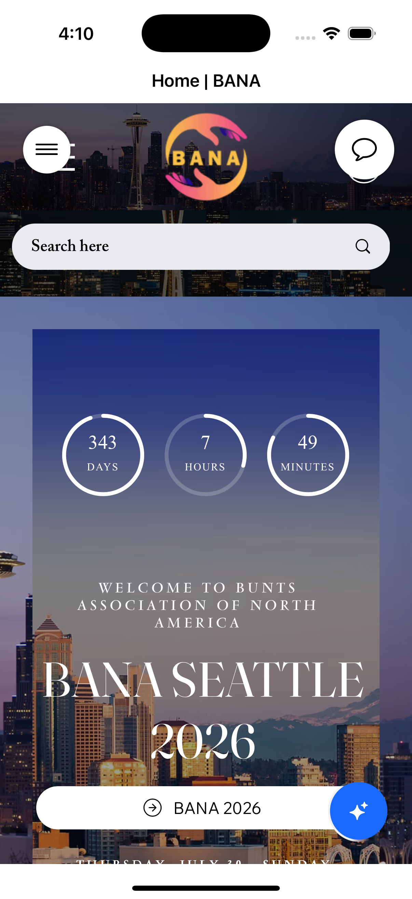

# BANA App

A SwiftUI iOS app for the Bunts Association of North America (BANA) that provides easy access to the BANA website and its key sections with native iOS features, comprehensive authentication, and peer-to-peer chat functionality.

## Features

### 🔐 Authentication
- **Google Sign-In**: Secure authentication using Google's OAuth 2.0
- **Facebook Login**: Social authentication with Facebook SDK
- **Microsoft Sign-In**: Enterprise authentication using Microsoft Authentication Library (MSAL)
- **Secure token management**: Proper handling of authentication tokens and user sessions

### 💬 Peer-to-Peer Chat
- **Local Discovery**: Automatically finds nearby BANA members
- **Host/Join Chat Rooms**: Create or join chat sessions
- **Real-time Messaging**: Instant text messaging between connected peers
- **Image Sharing**: Send and receive images in chat
- **Connection Status**: Visual indicators for connection and hosting status
- **User Profiles**: Display user information in chat

### 🏠 Landing Page
- Renders the main BANA website (https://www.bana.org) as the app's landing page
- Full web view integration with native iOS navigation
- Pull-to-refresh functionality
- Loading indicators and error handling

### 🍔 Burger Menu Navigation
- Slide-out burger menu for easy navigation
- Clean, modern UI with smooth animations
- Menu header with BANA branding and app version
- User profile information display
- Additional native features: About BANA and Settings

### 📰 Spotlight Section
- Direct access to BANA's blog section (https://www.bana.org/blog)
- Features community stories, interviews, and updates
- Includes recent posts like:
  - Simoul Alva's design journey
  - Community obituaries and memorials
  - Regional celebrations and events

### 📚 Resources Section
- Access to BANA's resources page (https://www.bana.org/resources)
- Community resources including:
  - BANA Knowledge Hub
  - Business Directory
  - BuntRoots
  - Moving to North America guide
  - Charitable Foundation information

### 🆕 Enhanced Native Features
- **Pull-to-Refresh**: Swipe down to reload content
- **Loading States**: Visual feedback during page loads
- **Error Handling**: Graceful error messages with retry options
- **Share Functionality**: Share pages via native iOS share sheet
- **Swipe Navigation**: Back/forward gestures in web view
- **Offline Support**: Better handling of network issues
- **User Profile**: Display authenticated user information
- **Sign Out**: Secure logout functionality

## Technical Implementation

### Architecture
- **SwiftUI**: Modern declarative UI framework
- **WebKit**: Native web view integration with enhanced features
- **Navigation**: Custom slide-out menu with state management
- **Authentication**: Multi-provider authentication with secure token handling
- **Peer-to-Peer Chat**: MultipeerConnectivity framework for local communication
- **Error Handling**: Comprehensive error states and recovery

### Authentication Providers
- **Google Sign-In**: Using GoogleSignIn SDK
- **Facebook Login**: Using Facebook SDK
- **Microsoft Sign-In**: Using MSAL (Microsoft Authentication Library)

### Key Components
- `ContentView`: Main app interface with enhanced navigation and authentication flow
- `AuthenticationView`: Beautiful authentication landing page
- `AuthenticationService`: Handles all authentication providers
- `ChatView`: Comprehensive peer-to-peer chat interface
- `ChatService`: Manages peer-to-peer communication
- `WebView`: UIViewRepresentable wrapper for WKWebView with loading states
- `MenuItem`: Reusable menu item component

### Features
- **Responsive Design**: Works on iPhone and iPad
- **Smooth Animations**: 0.3s ease-in-out transitions
- **Dynamic Titles**: Web page titles update automatically
- **Visual Feedback**: Selected menu items are highlighted
- **Touch Gestures**: Tap outside menu to close, swipe navigation
- **Accessibility**: VoiceOver support and accessibility features
- **User Management**: Display user profile and handle authentication state
- **Local Communication**: Secure peer-to-peer messaging

## Setup Instructions

### Prerequisites
- iOS 14.0+
- Xcode 12.0+
- Swift 5.3+
- Developer accounts with Google, Facebook, and Microsoft

### Authentication Setup
1. **Configure Providers**: Follow the [Authentication Setup Guide](AUTHENTICATION_SETUP.md)
2. **Update Configuration Files**: Replace placeholder values with actual credentials
3. **Test Authentication**: Verify each provider works correctly

### Build and Run
1. **Open in Xcode**: Open the `bana.xcodeproj` file
2. **Select Target**: Choose your target device or simulator
3. **Build & Run**: Press Cmd+R to build and run the app

## Requirements

- iOS 14.0+
- Xcode 12.0+
- Swift 5.3+

## Network Configuration

The app includes App Transport Security settings to allow:
- HTTPS connections to bana.org
- HTTP fallback for compatibility
- Subdomain access for bana.org
- Authentication provider endpoints

## App Store Submission

### Prerequisites
- **Apple Developer Program**: $99/year membership required
- **App Store Connect**: Create app record and configure metadata
- **App Store Guidelines**: Ensure compliance with Apple's policies

### Enhanced Features for App Store Approval
- **Native iOS Features**: Pull-to-refresh, share functionality, loading states
- **Authentication**: Secure multi-provider authentication
- **Peer-to-Peer Chat**: Local communication without server dependency
- **Error Handling**: Comprehensive error states and user feedback
- **Accessibility**: VoiceOver support and accessibility features
- **Performance**: Optimized web view loading and caching
- **User Experience**: Native iOS design patterns and interactions

### Submission Checklist
- [ ] Apple Developer Program membership
- [ ] App Store Connect app record created
- [ ] App metadata and descriptions prepared
- [ ] Screenshots for different device sizes
- [ ] App icon in all required sizes
- [ ] Privacy policy (required for authentication and chat)
- [ ] App review guidelines compliance
- [ ] Testing on multiple devices
- [ ] Archive and upload to App Store Connect

### Bundle Configuration
- **Bundle Identifier**: `org.bana.bana` (configurable)
- **Version**: 1.0
- **Build**: 1
- **Deployment Target**: iOS 14.0+

## About BANA

BANA (Bunts Association of North America) is a community organization that serves the Bunts community in North America. The app provides easy access to:

- Community news and updates
- Cultural resources and information
- Business networking opportunities
- Educational content and scholarships
- Regional events and celebrations
- Secure member authentication
- Local peer-to-peer communication

## Development

This app was created using SwiftUI and follows iOS design guidelines. The web view integration allows users to access the full BANA website experience while maintaining a native iOS feel with enhanced features for better user experience.

### Recent Enhancements
- Added comprehensive authentication system
- Implemented Google, Facebook, and Microsoft Sign-In
- Added peer-to-peer chat functionality
- Added pull-to-refresh functionality
- Implemented comprehensive error handling
- Added share functionality for pages
- Enhanced loading states and user feedback
- Improved accessibility features
- Added native iOS navigation gestures
- Created secure local communication system

## Security

The app implements industry-standard security practices:
- OAuth 2.0 authentication flows
- Secure token storage and management
- Encrypted peer-to-peer communication
- HTTPS-only communication
- Proper error handling without exposing sensitive information
- No server storage of chat messages
- Regular security updates and dependency management

## Support

For support or questions about the BANA app:
- Visit: https://www.bana.org
- Contact: Through the BANA website
- Authentication Setup: See [AUTHENTICATION_SETUP.md](AUTHENTICATION_SETUP.md)

---

*Created by Vijeth Shetty*
*Version 1.0 - Enhanced with Authentication and Chat for App Store submission* 